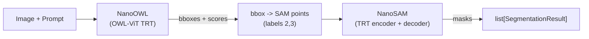

# NanoOWL + NanoSAM Backend

## Architecture

The backend pipes text prompts through two TensorRT-accelerated models:




Three TRT engines are required at runtime:

- **OWL image encoder** -- built from OWL-ViT HuggingFace weights via ONNX export + `trtexec`
- **NanoSAM image encoder** -- built from pre-trained ResNet18 ONNX (downloadable)
- **NanoSAM mask decoder** -- built from MobileSAM mask decoder ONNX (downloadable or exported from `mobile_sam.pt`)

## Files to Create/Modify

### 1. Backend implementation: `src/res/backends/nanoowl_nanosam.py`

New file. Subclasses `Backend`, follows the pattern of [sam3.py](src/res/backends/sam3.py).

- **Constructor** accepts: `owl_model_name` (default `"google/owlvit-base-patch32"`), `owl_engine_path`, `sam_image_encoder_engine_path`, `sam_mask_decoder_engine_path`, `detection_threshold` (default 0.1), `device` (default `"cuda"`)
- Engine paths resolve via constructor arg, then env vars (`RES_NANOOWL_ENGINE`, `RES_NANOSAM_IMAGE_ENCODER_ENGINE`, `RES_NANOSAM_MASK_DECODER_ENGINE`), then raise a clear error
- `_ensure_models()` lazy-loads both `nanoowl.owl_predictor.OwlPredictor` (with TRT engine) and `nanosam.utils.predictor.Predictor`
- `segment()` flow:
  1. `OwlPredictor.predict(pil_image, [prompt], threshold=...)` to get boxes + scores
  2. `sam_predictor.set_image(pil_image)` once
  3. For each detected box: convert to SAM points (label 2 for top-left, label 3 for bottom-right), call `sam_predictor.predict(points, point_labels)`, pick best-IoU mask channel, threshold at 0, scale to 0/255 uint8
  4. Return `list[SegmentationResult]`
- `is_available()` checks for `nanoowl`, `nanosam`, `tensorrt`, `torch2trt` packages

### 2. Register backend: `src/res/backends/__init__.py`

Add import of `NanoOwlNanoSamBackend` and `register_backend("nanoowl_nanosam", NanoOwlNanoSamBackend)` following the existing pattern.

### 3. TRT engine build scripts: `scripts/build_nanoowl_nanosam_engines.py`

Single CLI script (using `click` since it's already a dep) with subcommands:

- `**owl-engine`** -- instantiates `OwlPredictor`, calls `build_image_encoder_engine()`. Args: `--output`, `--model-name`, `--fp16/--no-fp16`
- `**sam-mask-decoder`** -- exports MobileSAM mask decoder to ONNX via `nanosam.tools.export_sam_mask_decoder_onnx`, then runs `trtexec` with dynamic point shapes. Args: `--checkpoint` (mobile_sam.pt), `--output`, `--onnx-path` (skip export if provided)
- `**sam-image-encoder`** -- runs `trtexec` on a provided ONNX file (downloaded separately). Args: `--onnx`, `--output`, `--fp16/--no-fp16`
- `**all**` -- convenience to run all three in sequence

Deps: `trtexec` must be on PATH (documented in README).

### 4. Update `pyproject.toml`

- Add optional dependency group `nanoowl-nanosam`:

```
  nanoowl-nanosam = ["torch>=2.0", "torchvision", "nanoowl", "nanosam", "transformers", "tensorrt", "torch2trt"]
  

```

- Add `[tool.uv.sources]` entries for `nanoowl` and `nanosam` pointing to `third_party/` editable installs

### 5. Update `README.md`

Add a new section "NanoOWL + NanoSAM Setup" documenting:

- System requirements (NVIDIA GPU, CUDA, TensorRT installed, `trtexec` on PATH)
- Install steps (`uv sync --extra nanoowl-nanosam`, submodule init)
- Checkpoint / ONNX download (link to NanoSAM Google Drive for `resnet18_image_encoder.onnx` and `mobile_sam_mask_decoder.onnx`, or export from `mobile_sam.pt`)
- Engine build commands using the script
- Env var configuration for engine paths
- Usage via CLI and Python API
- Add row to the backends table

### 6. Tests: `tests/unit/test_nanoowl_nanosam_backend.py`

Following the [test_sam3_backend.py](tests/unit/test_sam3_backend.py) pattern:

- `test_registered` -- backend name in `BACKEND_REGISTRY`
- `test_is_available_returns_bool` -- type check
- `test_constructor_stores_params` -- verify all constructor args stored
- `test_resolve_engine_paths_from_env` -- monkeypatch env vars, verify resolution
- `test_resolve_engine_paths_missing_raises` -- no constructor arg, no env var -> clear error message
- `test_segment_skips_without_deps` -- `pytest.skip` if `is_available()` is False
- `test_owl_model_name_configurable` -- verify non-default model name stored

